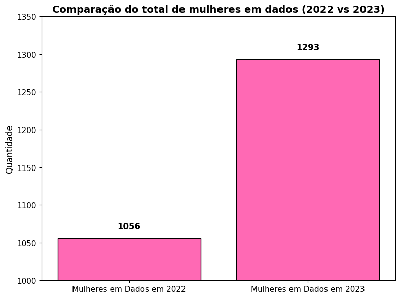
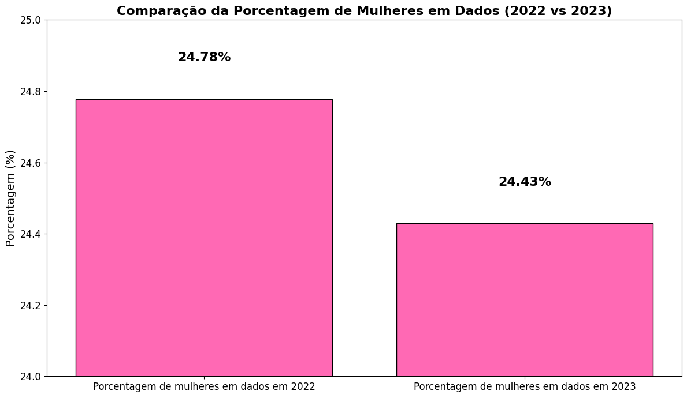

# Relatório

 O relatório é baseado conforme as informações obtidas através dos dados coletados. A maior parte desses dados eram textuais, gerando uma análise exploratória fundamental para o entendimento das experiências profissionais das mulheres na área de dados entre os anos de 2022 e 2023.

## Primeira parte da análise exploratória

Através da biblioteca matplotlib, foram gerados dois gráficos no arquivo 'tratamento-dados.ipynb'.

* O primeiro gráfico apresenta a quantidade total absoluta de mulheres nos anos de 2022 e 2023. Em 2022, o total de mulheres foi de 1.056, enquanto, em 2023, esse número subiu para 1.293, representando um acréscimo de 237 mulheres no mercado de dados em 2023. Esse crescimento absoluto reflete uma expansão numérica, mas não necessariamente uma melhoria significativa na representatividade.

* Por outro lado, quando analisamos esses números em percentual, a entrada de 237 mulheres a mais em 2023 revelou-se insignificante em termos de proporção, com uma redução de 0,35% na quantidade relativa de mulheres em comparação ao total de homens na área. Isso evidencia que, apesar do aumento absoluto, a desigualdade de gênero no setor permanece praticamente inalterada.

## Considerações

 O presente trabalho é relevante para a compreensão do contexto da área de tecnologia e seu mercado de trabalho. A área está em constante ampliação e sua demanda cada vez maior nos dias atuais, os salários são relativamente atraentes e há grandes possibilidades de trabalho remoto e/ou home office. Por isso, é importante a discussão sobre a ideia de incluir e transformar o mercado tecnólogico enfatizando o gênero feminino na área para maior diversidade e inclusão.